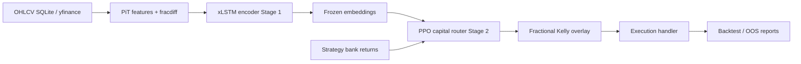

# Multi-Strategy RL Trading Bot

A two-stage pipeline that learns a market-state representation, routes capital across a fixed strategy bank with reinforcement learning, sizes risk with fractional Kelly, and simulates execution with passive limit orders. The design goal is to beat SPY on a risk-adjusted basis (Information Ratio), using free or cached OHLCV where possible.

## Architecture

Data flows through point-in-time (PiT) features, a frozen encoder, an RL router, Kelly sizing, and an execution adapter. Training and backtests share the same abstractions so behavior stays consistent offline and when keys are added later.



| Stage | Role | Main code |
|-------|------|-----------|
| 1 | Self-supervised xLSTM on PiT features (MSE + optional OU penalty); checkpoint frozen for RL | `models/xlstm/` |
| 2 | PPO allocates weights across three strategies on purged walk-forward folds | `models/ppo/`, `rl/gym_trading_env.py` |
| Bank | Daily stat-arb, vol breakout (15m→daily), mean reversion (5m→daily) | `strategies/` |
| Risk | Half-Kelly (configurable) on recent strategy returns | `core/risk_manager.py` |
| Execution | Passive limit fills in backtest; Alpaca limits when configured | `adapters/execution/` |

Objective: maximize Information Ratio vs SPY with turnover and transaction-cost penalties aligned between the Gym env and the event-driven backtester.

## Directory layout

```
Multi-Strategy ML based trading bot/
├── config/
│   ├── settings.yaml          # Single source of runtime config
│   └── settings_store.py      # Load/save + defaults for dashboard
├── adapters/                  # Data & execution implementations
│   ├── factory.py             # create_data_handler / create_execution_handler
│   ├── data/                  # yfinance, Alpaca historical (minimal)
│   └── execution/             # backtest limits, Alpaca limits
├── core/                      # Abstract interfaces + Kelly risk manager
├── data/
│   ├── features/              # PiT features, fracdiff, FRED macro, EDGAR sentiment
│   └── harvester/             # sync pipeline, SQLite BarStore, Alpaca stream placeholder
├── models/
│   ├── xlstm/                 # Encoder, OU loss, training, inference
│   └── ppo/                   # PPO router training
├── strategies/                # Stat-arb, vol breakout, mean reversion, bank alignment
├── rl/                        # Gymnasium env, purged walk-forward splits
├── pipeline/                  # Training tensors, walk-forward OOS, paper loop
├── backtesting/               # Portfolio simulator, event-driven backtester, reports
├── execution/                 # Limit-order primitives (used by adapters)
├── frontend/                  # Streamlit control panel
├── scripts/                   # CLI entrypoints (see below)
├── tests/                     # pytest suite (unit + bias audits)
├── .github/workflows/ci.yml   # GitHub Actions: pytest -m "not slow"
├── Dockerfile                 # Python 3.12 image for dashboard / dev
├── docker-compose.yml         # dashboard + dev services
└── requirements.txt
```

Artifacts written at runtime (not committed): `data/storage/market_data.db`, `models/xlstm/checkpoints/`, `models/ppo/checkpoints/`, `backtesting/reports/`.

## Prerequisites and install

- Python 3.12+ recommended (CI and Docker use 3.12; local 3.14 works if dependencies resolve).
- Optional: Docker for the Streamlit service without a local venv.

```bash
cd "/Users/deborshi/Multi-Strategy ML based trading bot"
python3 -m venv .venv
source .venv/bin/activate
pip install -r requirements.txt
export PYTHONPATH=.
```

Set `PYTHONPATH=.` (or use the project root in `sys.path` as the scripts already do) for all commands below.

## Configuration

Primary file: [`config/settings.yaml`](config/settings.yaml). The Streamlit dashboard edits the same file via **Save** in the sidebar.

| Section | Purpose |
|---------|---------|
| `universe` | Equity and ETF tickers for harvest and features |
| `data` | Provider (`yfinance` \| `alpaca`), SQLite path, intervals, lookback periods |
| `strategies` | Pair for stat-arb, z/ATR/RSI windows, `transaction_cost_bps`, `dynamic_pair_selection` |
| `features` | `frac_diff_d`, PiT `pit_shift`, optional `include_macro` / `include_sentiment` |
| `xlstm` | Architecture, training schedule, OU hyperparameters (`ou_gamma`, `ou_dt`), checkpoints |
| `ppo` | Stable-Baselines3 PPO hyperparameters and checkpoint dir |
| `risk` | Kelly overlay: `enabled`, `kelly_window`, `kelly_fraction` |
| `rl` | Embedding dim, strategy count, turnover penalty, purge embargo bars |
| `walk_forward` | Fold count, train/test sizes, smoke timesteps for dashboard |
| `execution` | `mode` (`backtest` \| `alpaca`), paper flag, limit-order latency/spread |
| `backtest` | Initial cash, rebalance threshold, `report_dir` |
| `diagnostics` | Audit bar count and seed for dashboard harness |

Programmatic access: `from config.settings_store import load_settings, save_settings`.

## API keys and offline behavior

Nothing in the default offline path requires paid APIs or live brokers.

| Key / environment | Used for | If missing |
|-------------------|----------|------------|
| *(none)* | Sync (yfinance), train xLSTM (`--no-yfinance` synthetic), PPO, backtest, walk-forward report, paper dry-run, dashboard on cached SQLite | Full offline stack |
| `FRED_API_KEY` | Macro series in `data/features/macro_fred.py` when `features.include_macro: true` | Macro columns zero-filled |
| `APCA_API_KEY_ID` + `APCA_API_SECRET_KEY` (or `ALPACA_API_KEY` / `ALPACA_SECRET_KEY`) | `data.provider: alpaca`, `AlpacaDataHandler`, live paper execution | Factory falls back to yfinance for data; execution stays on backtest handler unless mode is `alpaca` with keys |
| `SKIP_EDGAR_SENTIMENT=1` | Skip SEC download + FinBERT in tests/CI/Docker | Recommended for fast tests; set in CI and `docker-compose.yml` |

Sentiment (`features.include_sentiment: true`) uses SEC EDGAR + FinBERT and is slow; keep off unless you need it.

## Quick start (offline)

Minimal path without API keys: synthetic or cached data, train, evaluate, open the dashboard.

```bash
source .venv/bin/activate
export PYTHONPATH=.
export SKIP_EDGAR_SENTIMENT=1   # optional; speeds tests and matches CI

# 1) Market data (optional if you use synthetic xLSTM only)
python scripts/sync_data.py

# 2) Stage 1 — xLSTM (use --no-yfinance for fully offline features)
python scripts/train_xlstm.py --no-yfinance
# Checkpoints: models/xlstm/checkpoints/xlstm_best.pt, xlstm_frozen.pt, embeddings.npy

# 3) Stage 2 — PPO router (uses frozen embeddings + strategy bank)
python scripts/train_ppo.py

# 4) In-sample portfolio backtest
python scripts/run_backtest.py
python scripts/run_backtest.py --equal-weight    # baseline without PPO checkpoint
python scripts/run_backtest.py --execution       # also run SPY limit-order path

# 5) Phase 3 — OOS walk-forward and paper dry-run
python scripts/run_walk_forward_report.py
python scripts/run_paper_loop.py

# 6) Dashboard
./scripts/run_dashboard.sh
# or: streamlit run frontend/app.py  → http://localhost:8501
```

Reports:

- `backtesting/reports/latest_backtest.json` — last portfolio backtest
- `backtesting/reports/walk_forward_report.json` — purged OOS aggregates (+ per-fold CSVs unless `--no-csv`)
- `backtesting/reports/paper_loop_latest.json` — last paper-loop dry run

## CLI reference (`scripts/`)

All scripts add the repo root to `sys.path` automatically.

| Script | Command | Flags / notes |
|--------|---------|----------------|
| `sync_data.py` | `python scripts/sync_data.py` | Downloads universe OHLCV into `data/storage/market_data.db` (yfinance) |
| `train_xlstm.py` | `python scripts/train_xlstm.py` | `--no-yfinance` synthetic bars; `--device cpu\|cuda\|mps` |
| `train_ppo.py` | `python scripts/train_ppo.py` | `--require-encoder` fail without xLSTM checkpoint; `--fold N` train one fold only |
| `run_backtest.py` | `python scripts/run_backtest.py` | `--equal-weight` 1/3 each; `--execution` SPY limit simulation |
| `run_walk_forward_report.py` | `python scripts/run_walk_forward_report.py` | `--equal-weight`, `--no-csv`, `--require-encoder` |
| `run_paper_loop.py` | `python scripts/run_paper_loop.py` | `--equal-weight`; `--symbol SPY` (default) — dry run only, no live Alpaca |
| `run_dashboard.sh` | `./scripts/run_dashboard.sh` | Activates `.venv` if present; runs Streamlit on `frontend/app.py` |

Module smoke tests (bias audit and RL env):

```bash
python -m backtesting.event_driven_backtester
python -m rl.gym_trading_env
```

## Strategy bank

| Leg | Timeframe | Model |
|-----|-----------|--------|
| Stat-arb | Daily | Cointegration spread on configured pair (default NVDA/AMD); optional `dynamic_pair_selection` |
| Vol breakout | 15m → daily | ATR channel breakout |
| Mean reversion | 5m → daily | RSI + Bollinger |

Returns are aligned to a master daily index in `strategies/bank.py` for RL and backtests.

## Phase 2 — adapters, OU loss, Kelly, macro/sentiment

Training, backtest, sync, and pipeline code depend on `AbstractDataHandler` / `AbstractExecutionHandler` from [`core/interfaces.py`](core/interfaces.py), wired through [`adapters/factory.py`](adapters/factory.py). Application modules should not import yfinance or alpaca directly.

| Component | Path |
|-----------|------|
| Data (yfinance + SQLite) | `adapters/data/yfinance_handler.py` |
| Data (Alpaca historical, minimal) | `adapters/data/alpaca_data_handler.py` |
| Execution (simulated limits) | `adapters/execution/backtest_execution.py` |
| Execution (Alpaca paper limits) | `adapters/execution/alpaca_execution.py` |
| Kelly overlay | `core/risk_manager.py` |
| OU pretraining loss | `models/xlstm/custom_loss.py` |
| Macro (FRED) | `data/features/macro_fred.py` |
| Sentiment (FinBERT + EDGAR) | `data/features/sentiment_edgar.py` |

Relevant settings: `xlstm.ou_gamma`, `xlstm.ou_dt`, `risk.kelly_fraction`, `features.include_macro`, `features.include_sentiment`, `strategies.transaction_cost_bps`.

## Phase 3 — walk-forward OOS, paper loop, fracdiff, CI/Docker

| Feature | Location | CLI |
|---------|----------|-----|
| Purged walk-forward OOS report | `pipeline/walk_forward_report.py` | `scripts/run_walk_forward_report.py` |
| Paper rebalance dry-run (backtest execution only) | `pipeline/paper_trading_loop.py` | `scripts/run_paper_loop.py` |
| AFML fractional differentiation on log prices | `data/features/fracdiff.py` → `frac_diff` column in PiT frame | `features.frac_diff_d` in settings |
| GitHub Actions CI | `.github/workflows/ci.yml` | `pytest -m "not slow"` on push/PR to `main`/`master` |
| Containerized dashboard | `Dockerfile`, `docker-compose.yml` | `docker compose up dashboard` |

Docker services:

- `dashboard` — Streamlit on port 8501; mounts `config/`, `data/storage/`, `backtesting/reports/`, `models/`; sets `SKIP_EDGAR_SENTIMENT=1`.
- `dev` — interactive shell with repo bind-mount for development.

```bash
docker compose up dashboard
# UI: http://localhost:8501
```

Phase 3 commands use SQLite and/or synthetic features; they do not open Alpaca WebSocket streams or place live orders.

## Testing

```bash
export PYTHONPATH=.
export SKIP_EDGAR_SENTIMENT=1
pytest tests/ -q -m "not slow"
```

Slow marker: full xLSTM training smoke in `tests/test_xlstm.py` (`@pytest.mark.slow`). Run everything with `pytest tests/ -q` when you want the long test.

Coverage highlights: fracdiff, adapters, Kelly, OU loss, walk-forward report, paper loop, strategy bank, backtester look-ahead audit, purged splits.

## Foundation modules

- [`backtesting/event_driven_backtester.py`](backtesting/event_driven_backtester.py) — bar-by-bar event queue, limit fills, look-ahead audit
- [`rl/gym_trading_env.py`](rl/gym_trading_env.py) — PPO routing environment, cost-aware reward, purged walk-forward splits
- [`models/xlstm/`](models/xlstm/) — sLSTM + mLSTM blocks, next-step MSE (+ OU), freeze for RL

## Not implemented / requires keys

| Item | Status |
|------|--------|
| Alpaca live WebSocket ingest | Placeholder in `data/harvester/alpaca_stream.py` — `run_live_stream()` raises `NotImplementedError`; use `scripts/sync_data.py` for historical bars |
| Continuous live paper trading loop | `run_paper_loop.py` is a single dry-run rebalance via `BacktestExecutionHandler`, not a scheduled live service |
| Alpaca historical data handler | Minimal stub when keys are set; factory falls back to yfinance if keys are absent |
| Real-time SIP/IEX bar subscription | Not wired |

To experiment with Alpaca later: set keys, set `data.provider: alpaca` and/or `execution.mode: alpaca` with `execution.paper: true`, and implement WebSocket persistence in `alpaca_stream.py` calling `BarStore.upsert_bars`.
