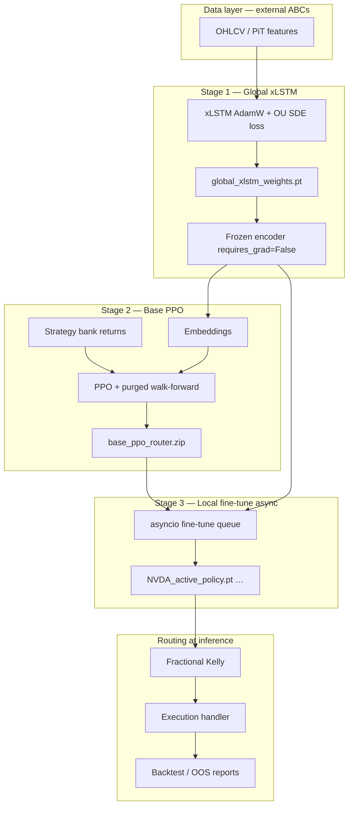

# Multi-Strategy RL Trading Bot

A **Global-to-Local** two-stage ML stack plus per-ticker policy adaptation: a frozen xLSTM market-state encoder, a walk-forward PPO capital router, and optional async micro-fine-tuning of only the final routing layer. Risk is sized with fractional Kelly; execution uses passive limit orders in simulation. The design goal is to beat SPY on a risk-adjusted basis (Information Ratio), using free or cached OHLCV where possible.

## Architecture

Data flows through point-in-time (PiT) features, a frozen encoder, an RL router, Kelly sizing, and an execution adapter. Training and backtests share the same abstractions so behavior stays consistent offline and when keys are added later.



| Stage | Role | Main code | Checkpoint |
|-------|------|-----------|------------|
| **1 — Global** | Self-supervised xLSTM on PiT features (MSE + OU SDE penalty); plateau → freeze | `models/xlstm/`, `pipeline/train_orchestrator.py` | `global_xlstm_weights.pt` |
| **2 — Base PPO** | PPO allocates weights across three strategies on **purged walk-forward** folds | `models/ppo/`, `rl/gym_trading_env.py` | `base_ppo_router.zip` |
| **3 — Local** | Async per-ticker micro-train: xLSTM frozen; **only** `action_net` + `log_std` unfrozen | `pipeline/train_orchestrator.py` | `{TICKER}_active_policy.pt` |
| Bank | Daily stat-arb, vol breakout (15m→daily), mean reversion (5m→daily) | `strategies/` | — |
| Risk | Half-Kelly (configurable) on recent strategy returns | `core/risk_manager.py` | — |
| Execution | Passive limit fills in backtest; Alpaca limits when configured | `adapters/execution/` | — |

**Objective:** maximize Information Ratio vs SPY with turnover and transaction-cost penalties aligned between the Gym env and the event-driven backtester.

**Stage handoff invariants** (enforced in `train_orchestrator.py`):

- `features.shape[1] == encoder.input_dim`
- `embeddings.shape[1] == PPO observation_space.shape[0]`
- `strategy_returns.shape[1] == PPO action_space.shape[0] == action_net.out_features`
- Stage 3 uses `PPO.load(..., env=)` — never re-instantiates `PPO(...)`, so the MLP extractor dimensions stay locked to Stage 2.

## Directory layout

```
Multi-Strategy ML based trading bot/
├── config/
│   ├── settings.yaml          # Single source of runtime config
│   └── settings_store.py      # Load/save + defaults for dashboard
├── adapters/                  # Data & execution implementations
│   ├── factory.py             # create_data_handler / create_execution_handler
│   ├── data/                  # yfinance, Alpaca historical (minimal)
│   └── execution/             # backtest limits, Alpaca limits
├── core/                      # Abstract interfaces + Kelly risk manager
├── data/
│   ├── features/              # PiT features, fracdiff, FRED macro, EDGAR sentiment
│   └── harvester/             # sync pipeline, SQLite BarStore, Alpaca stream placeholder
├── models/
│   ├── xlstm/                 # Encoder, OU loss, cells (sLSTM/mLSTM), training, inference
│   └── ppo/                   # PPO router training
├── strategies/                # Stat-arb, vol breakout, mean reversion, bank alignment
├── rl/                        # Gymnasium env, purged walk-forward splits
├── pipeline/
│   ├── train_orchestrator.py    # 3-stage Global-to-Local training (PyTorch + asyncio)
│   ├── orchestrator_provider.py # SettingsFeatureProvider wired to adapters + strategy bank
│   ├── training_data.py         # Embeddings + strategy bank tensors for RL
│   ├── walk_forward_report.py   # Purged OOS report
│   └── paper_trading_loop.py    # Paper rebalance dry-run
├── backtesting/               # Portfolio simulator, event-driven backtester, reports
├── execution/                 # Limit-order primitives (used by adapters)
├── frontend/                  # Streamlit control panel
├── scripts/                   # CLI entrypoints (see below)
├── tests/                     # pytest suite (unit + bias audits)
├── .github/workflows/ci.yml   # GitHub Actions: pytest -m "not slow"
├── Dockerfile                 # Python 3.12 image for dashboard / dev
├── docker-compose.yml         # dashboard + dev services
└── requirements.txt
```

**Artifacts at runtime** (not committed):

| Path | Description |
|------|-------------|
| `data/storage/market_data.db` | SQLite OHLCV |
| `models/xlstm/checkpoints/` | `xlstm_best.pt`, `xlstm_frozen.pt`, `embeddings.npy` (CLI training) |
| `models/ppo/checkpoints/` | `ppo_router.zip`, `train_summary.json` (CLI training) |
| `{out_dir}/global_xlstm_weights.pt` | Orchestrator Stage 1 frozen encoder |
| `{out_dir}/base_ppo_router.zip` | Orchestrator Stage 2 base policy |
| `{out_dir}/ticker_policies/{TICKER}_active_policy.pt` | Stage 3 delta (`action_net` + `log_std` only) |
| `backtesting/reports/` | Backtest / walk-forward / paper-loop JSON |

## Prerequisites and install

- Python 3.12+ recommended (CI and Docker use 3.12; local 3.14 works if dependencies resolve).
- Optional: Docker for the Streamlit service without a local venv.
- GPU: CUDA or Apple MPS optional; orchestrator auto-selects `cuda` → `mps` → `cpu`.

```bash
cd "/Users/deborshi/Multi-Strategy ML based trading bot"
python3 -m venv .venv
source .venv/bin/activate
pip install -r requirements.txt
export PYTHONPATH=.
```

Set `PYTHONPATH=.` for all commands below.

## Configuration

Primary file: [`config/settings.yaml`](config/settings.yaml). The Streamlit dashboard edits the same file via **Save** in the sidebar.

| Section | Purpose |
|---------|---------|
| `universe` | Equity and ETF tickers for harvest and features |
| `data` | Provider (`yfinance` \| `alpaca`), SQLite path, intervals, lookback periods |
| `strategies` | Pair for stat-arb, z/ATR/RSI windows, `transaction_cost_bps`, `dynamic_pair_selection` |
| `features` | `frac_diff_d`, PiT `pit_shift`, optional `include_macro` / `include_sentiment` |
| `xlstm` | Architecture, training schedule, OU hyperparameters (`ou_gamma`, `ou_dt`), checkpoints |
| `ppo` | Stable-Baselines3 PPO hyperparameters and checkpoint dir |
| `risk` | Kelly overlay: `enabled`, `kelly_window`, `kelly_fraction` |
| `rl` | Embedding dim, strategy count, turnover penalty, purge embargo bars |
| `walk_forward` | Fold count, train/test sizes, smoke timesteps for dashboard |
| `orchestrator` | Stage 3 fine-tune: `finetune_epochs`, `finetune_steps_per_epoch`, `finetune_lr` |
| `execution` | `mode` (`backtest` \| `alpaca`), paper flag, limit-order latency/spread |
| `backtest` | Initial cash, rebalance threshold, `report_dir` |
| `diagnostics` | Audit bar count and seed for dashboard harness |

Programmatic access: `from config.settings_store import load_settings, save_settings`.

## API keys and offline behavior

Nothing in the default offline path requires paid APIs or live brokers.

| Key / environment | Used for | If missing |
|-------------------|----------|------------|
| *(none)* | Sync (yfinance), train xLSTM (`--no-yfinance` synthetic), PPO, backtest, walk-forward report, paper dry-run, dashboard on cached SQLite | Full offline stack |
| `FRED_API_KEY` | Macro series in `data/features/macro_fred.py` when `features.include_macro: true` | Macro columns zero-filled |
| `APCA_API_KEY_ID` + `APCA_API_SECRET_KEY` (or `ALPACA_API_KEY` / `ALPACA_SECRET_KEY`) | `data.provider: alpaca`, `AlpacaDataHandler`, live paper execution | Factory falls back to yfinance for data; execution stays on backtest handler unless mode is `alpaca` with keys |
| `SKIP_EDGAR_SENTIMENT=1` | Skip SEC download + FinBERT in tests/CI/Docker | Recommended for fast tests; set in CI and `docker-compose.yml` |

Sentiment (`features.include_sentiment: true`) uses SEC EDGAR + FinBERT and is slow; keep off unless you need it.

### Alpaca paper trading setup

Create a **Paper Trading** API key in the Alpaca dashboard, then export in your shell (never commit keys):

```bash
export APCA_API_KEY_ID="your_key_id"
export APCA_API_SECRET_KEY="your_secret"
export APCA_API_BASE_URL="https://paper-api.alpaca.markets"
```

Verify (prints booleans only):

```bash
python3 - <<'PY'
import os
print("KEY_ID set:", bool(os.getenv("APCA_API_KEY_ID")))
print("SECRET set:", bool(os.getenv("APCA_API_SECRET_KEY")))
PY
```

| Goal | `settings.yaml` |
|------|-----------------|
| Historical bars from Alpaca | `data.provider: alpaca` |
| Paper limit orders | `execution.mode: alpaca`, `execution.paper: true` |
| Offline training only | `data.provider: yfinance`, `execution.mode: backtest` (default) |

Alpaca uses one key pair for both **Market Data API** (historical bars) and **Trading API** (limit orders). Live WebSocket ingest is not wired yet — use `scripts/sync_data.py` for bars.

## Quick start (offline)

### Path A — CLI scripts (stages 1–2)

```bash
source .venv/bin/activate
export PYTHONPATH=.
export SKIP_EDGAR_SENTIMENT=1   # optional; speeds tests and matches CI

# 1) Market data (optional if you use synthetic xLSTM only)
python scripts/sync_data.py

# 2) Stage 1 — xLSTM (use --no-yfinance for fully offline features)
python scripts/train_xlstm.py --no-yfinance
# → models/xlstm/checkpoints/xlstm_best.pt, xlstm_frozen.pt, embeddings.npy

# 3) Stage 2 — PPO router (uses frozen embeddings + strategy bank)
python scripts/train_ppo.py

# 4) In-sample portfolio backtest
python scripts/run_backtest.py
python scripts/run_backtest.py --equal-weight
python scripts/run_backtest.py --execution

# 5) OOS walk-forward and paper dry-run
python scripts/run_walk_forward_report.py
python scripts/run_paper_loop.py

# 6) Dashboard
./scripts/run_dashboard.sh
# → http://localhost:8501
```

**Note:** `train_xlstm.py` prints little during training; output appears at the end (`epochs=…`, `checkpoint=…`). Use `python3` (or activate `.venv`) — macOS often has no `python` command.

### Recommended workflow after Stage 1

Once xLSTM finishes (`xlstm_frozen.pt` exists):

```bash
python scripts/train_ppo.py              # Stage 2
python scripts/run_backtest.py           # PPO-routed backtest
python scripts/run_backtest.py --equal-weight   # baseline comparison
python scripts/run_walk_forward_report.py
python scripts/run_paper_loop.py --symbol SPY
```

### Path B — Three-stage orchestrator (Global-to-Local)

Use the CLI (wired to [`pipeline/orchestrator_provider.py`](pipeline/orchestrator_provider.py)):

```bash
python scripts/sync_data.py
python scripts/run_orchestrator.py -v
python scripts/run_orchestrator.py --tickers NVDA AMD META --device mps
```

For custom data sources, implement `FeatureProvider` in [`pipeline/train_orchestrator.py`](pipeline/train_orchestrator.py) or extend `SettingsFeatureProvider`:

```python
import asyncio
from pathlib import Path
from config.settings_store import load_settings
from pipeline.train_orchestrator import (
    Stage1Config,
    Stage2Config,
    Stage3Config,
    FeatureProvider,
    run_full_orchestration,
)

class MyProvider(FeatureProvider):
  # Return pre-computed PiT-safe numpy arrays from your data ABCs.
  def get_global_features(self): ...
  def get_global_strategy_returns(self): ...
  def get_global_benchmark_returns(self): ...
  def get_ticker_features(self, ticker: str): ...
  def get_ticker_strategy_returns(self, ticker: str): ...
  def get_ticker_benchmark_returns(self, ticker: str): ...

settings = load_settings()
asyncio.run(
  run_full_orchestration(
    provider=MyProvider(),
    stage1_config=Stage1Config(input_dim=your_dim, embedding_dim=settings["rl"]["embedding_dim"]),
    stage2_config=Stage2Config(),
    stage3_config=Stage3Config(epochs=20),
    env_settings=settings,
    out_dir=Path("models/orchestrator"),
    tickers=["NVDA", "AMD"],
    prefer_device=None,       # auto cuda/mps/cpu
    max_concurrent_ft=1,      # GPU serialization for Stage 3 workers
  )
)
```

**Stage 1:** AdamW + `XLSTMPretrainingLoss` (MSE + γ·L_OU); validation plateau → `requires_grad=False` on all encoder params → `global_xlstm_weights.pt`.

**Stage 2:** Frozen encoder → embeddings → `TradingRoutingEnv` + `PurgedWalkForwardSplitter` → `base_ppo_router.zip`.

**Stage 3:** `TickerFineTuneQueue` (`asyncio.Queue` + `ThreadPoolExecutor`) loads global weights, keeps xLSTM frozen, unfreezes only `policy.action_net` and `policy.log_std`, runs 20×1024 env steps per ticker, saves `{ticker}_active_policy.pt` (routing-layer delta only).

Reports:

- `backtesting/reports/latest_backtest.json`
- `backtesting/reports/walk_forward_report.json`
- `backtesting/reports/paper_loop_latest.json`

## CLI reference (`scripts/`)

All scripts add the repo root to `sys.path` automatically.

| Script | Command | Flags / notes |
|--------|---------|----------------|
| `sync_data.py` | `python scripts/sync_data.py` | Downloads universe OHLCV into `data/storage/market_data.db` (yfinance) |
| `train_xlstm.py` | `python scripts/train_xlstm.py` | `--no-yfinance` synthetic bars; `--device cpu\|cuda\|mps` |
| `train_ppo.py` | `python scripts/train_ppo.py` | `--require-encoder` fail without xLSTM checkpoint; `--fold N` train one fold only |
| `run_backtest.py` | `python scripts/run_backtest.py` | `--equal-weight` 1/3 each; `--execution` SPY limit simulation |
| `run_walk_forward_report.py` | `python scripts/run_walk_forward_report.py` | `--equal-weight`, `--no-csv`, `--require-encoder` |
| `run_paper_loop.py` | `python scripts/run_paper_loop.py` | `--equal-weight`; `--symbol SPY` — dry run only |
| `run_dashboard.sh` | `./scripts/run_dashboard.sh` | Activates `.venv` if present; runs Streamlit |
| `run_orchestrator.py` | `python scripts/run_orchestrator.py` | Full 3-stage Global-to-Local pipeline; see flags below |

**`run_orchestrator.py` flags:**

| Flag | Purpose |
|------|---------|
| `--out-dir` | Default `models/orchestrator/` (`global_xlstm_weights.pt`, `base_ppo_router.zip`, `ticker_policies/`) |
| `--tickers NVDA AMD` | Stage 3 fine-tune list (default: `universe.equities`) |
| `--global-symbol NVDA` | Primary symbol for Stage 1/2 (default: first equity) |
| `--no-yfinance` | Synthetic global features (offline smoke); sync SQLite for real strategy bank |
| `--device cpu\|cuda\|mps` | Torch device override |
| `--max-concurrent-ft N` | Parallel Stage-3 workers (default 1) |
| `-v` | Verbose orchestrator logging |

```bash
python scripts/sync_data.py
python scripts/run_orchestrator.py -v
python scripts/run_orchestrator.py --tickers NVDA AMD --device mps
```

### Long history and multiple stocks

The repo trains **one global xLSTM** on a primary symbol, then **per-ticker Stage 3** policies — not a single pooled cross-sectional encoder yet.

| Setting | Purpose |
|---------|---------|
| `data.yfinance_period: 5y` | ~5 years of daily bars (yfinance) |
| `xlstm.yfinance_period: 5y` | Keep in sync with `data` |
| `universe.equities: [...]` | All tickers for sync + Stage 3 fine-tune |
| `walk_forward.min_train_size: 504` | ~2 years minimum train per fold (optional) |

```bash
python scripts/sync_data.py
python scripts/run_orchestrator.py -v --global-symbol NVDA --tickers NVDA AMD META GOOGL MSFT
```

**Intraday limit:** yfinance caps 5m/15m history (~60 days). Daily features and stat-arb can use 5y; vol-breakout and mean-reversion legs use shorter intraday windows unless you add Alpaca historical or another source.

Module smoke tests:

```bash
python -m backtesting.event_driven_backtester
python -m rl.gym_trading_env
```

## Strategy bank

| Leg | Timeframe | Model |
|-----|-----------|--------|
| Stat-arb | Daily | Cointegration spread on configured pair (default NVDA/AMD); optional `dynamic_pair_selection` |
| Vol breakout | 15m → daily | ATR channel breakout |
| Mean reversion | 5m → daily | RSI + Bollinger |

Returns are aligned to a master daily index in `strategies/bank.py` for RL and backtests.

## xLSTM and OU loss (math layer)

| Module | Notes |
|--------|--------|
| `models/xlstm/cells.py` | sLSTM: log-space exponential gating + `c/n` readout; mLSTM: scalar gates, matrix memory `C`, normalizer `n`, retrieval `Cq / max(|n·q|, 1)` |
| `models/xlstm/custom_loss.py` | L_total = L_MSE + γ·L_OU; smooth φ bound, innovation log-ratio, stationarity on φ_raw, mean-reversion θ on φ_raw, regime variance-growth term |
| `models/xlstm/encoder.py` | `load_checkpoint(map_location=...)` pins model to device; backward-compat for older mLSTM checkpoints; `encode()` restores train/eval mode |
| `models/xlstm/train.py` | Synthetic bars use a strictly-positive geometric random walk (`--no-yfinance`) |
| `models/xlstm/dataset.py` | Causal windows: `x = features[t-L+1:t+1]`, `y = features[t+1]` (PiT-shifted upstream) |

Forward passes are strictly autoregressive — no look-ahead in the cell unroll or dataset indexing.

## Phase 2 — adapters, OU loss, Kelly, macro/sentiment

Training, backtest, sync, and pipeline code depend on `AbstractDataHandler` / `AbstractExecutionHandler` from [`core/interfaces.py`](core/interfaces.py), wired through [`adapters/factory.py`](adapters/factory.py). Application modules should not import yfinance or alpaca directly.

| Component | Path |
|-----------|------|
| Data (yfinance + SQLite) | `adapters/data/yfinance_handler.py` |
| Data (Alpaca historical, minimal) | `adapters/data/alpaca_data_handler.py` |
| Execution (simulated limits) | `adapters/execution/backtest_execution.py` |
| Execution (Alpaca paper limits) | `adapters/execution/alpaca_execution.py` |
| Kelly overlay | `core/risk_manager.py` |
| OU pretraining loss | `models/xlstm/custom_loss.py` |
| Macro (FRED) | `data/features/macro_fred.py` |
| Sentiment (FinBERT + EDGAR) | `data/features/sentiment_edgar.py` |

Relevant settings: `xlstm.ou_gamma`, `xlstm.ou_dt`, `risk.kelly_fraction`, `features.include_macro`, `features.include_sentiment`, `strategies.transaction_cost_bps`.

## Phase 3 — walk-forward OOS, paper loop, fracdiff, CI/Docker

| Feature | Location | CLI |
|---------|----------|-----|
| Purged walk-forward OOS report | `pipeline/walk_forward_report.py` | `scripts/run_walk_forward_report.py` |
| Paper rebalance dry-run (backtest execution only) | `pipeline/paper_trading_loop.py` | `scripts/run_paper_loop.py` |
| AFML fractional differentiation on log prices | `data/features/fracdiff.py` → `frac_diff` column in PiT frame | `features.frac_diff_d` in settings |
| GitHub Actions CI | `.github/workflows/ci.yml` | `pytest -m "not slow"` on push/PR to `main`/`master` |
| Containerized dashboard | `Dockerfile`, `docker-compose.yml` | `docker compose up dashboard` |

```bash
docker compose up dashboard
# UI: http://localhost:8501
```

Phase 3 commands use SQLite and/or synthetic features; they do not open Alpaca WebSocket streams or place live orders.

## Deployment (DigitalOcean / VPS)

Minimal production layout: Ubuntu droplet + venv or Docker, scheduled sync/train jobs, optional Streamlit behind a firewall.

**Suggested droplet:** 4–8 vCPU, 8–16 GB RAM, 80+ GB SSD.

```bash
# On droplet
sudo apt update && sudo apt install -y git python3-venv python3-pip
git clone https://github.com/NaMEleSs0616/Multi-Strategy-ML-Based-Trading-Bot.git
cd Multi-Strategy-ML-Based-Trading-Bot
python3 -m venv .venv && source .venv/bin/activate
pip install -r requirements.txt
export PYTHONPATH=.
export SKIP_EDGAR_SENTIMENT=1
# Set APCA_* env vars here for paper trading

python scripts/sync_data.py
python scripts/train_xlstm.py
python scripts/train_ppo.py
```

**Docker dashboard:**

```bash
docker compose up -d dashboard   # http://<host>:8501 — restrict with UFW to your IP
```

**Cron example** (daily sync, weekly retrain):

```cron
0 6 * * * cd /path/to/repo && .venv/bin/python scripts/sync_data.py >> logs/sync.log 2>&1
0 2 * * 0 cd /path/to/repo && .venv/bin/python scripts/train_xlstm.py >> logs/xlstm.log 2>&1
```

Back up `data/storage/market_data.db`, `models/xlstm/checkpoints/`, `models/ppo/checkpoints/`, and `backtesting/reports/`.

## Troubleshooting

| Symptom | Fix |
|---------|-----|
| `command not found: python` | Use `python3` or `source .venv/bin/activate` then `python` |
| `train_xlstm.py` shows no output | Normal — wait for final `epochs=…` line; training can take minutes on CPU |
| `RuntimeError` loading xLSTM checkpoint (mLSTM shape mismatch) | Retrain: `python scripts/train_xlstm.py` — or pull latest (encoder loads old checkpoints with conversion) |
| `invalid value encountered in log` with `--no-yfinance` | Fixed in latest `train.py` (positive synthetic prices); pull latest or retrain |
| Paper loop fails without PPO | Use `--equal-weight`, or run `train_ppo.py` first |
| yfinance 403 / download errors | Use cached SQLite from `sync_data.py`; check network/proxy |

## Testing

```bash
export PYTHONPATH=.
export SKIP_EDGAR_SENTIMENT=1
pytest tests/ -q -m "not slow"
```

Slow marker: full xLSTM training smoke in `tests/test_xlstm.py` (`@pytest.mark.slow`).

Coverage highlights: fracdiff, adapters, Kelly, OU loss (`tests/test_custom_loss.py`), walk-forward report, paper loop, strategy bank, backtester look-ahead audit, purged splits, xLSTM inference alignment.

## Foundation modules

- [`backtesting/event_driven_backtester.py`](backtesting/event_driven_backtester.py) — bar-by-bar event queue, limit fills, look-ahead audit
- [`rl/gym_trading_env.py`](rl/gym_trading_env.py) — PPO routing environment, cost-aware reward, purged walk-forward splits
- [`models/xlstm/`](models/xlstm/) — sLSTM + mLSTM blocks, OU-informed pretraining, freeze for RL
- [`pipeline/train_orchestrator.py`](pipeline/train_orchestrator.py) — Global-to-Local three-stage training + async Stage 3 queue
- [`pipeline/orchestrator_provider.py`](pipeline/orchestrator_provider.py) — `SettingsFeatureProvider` for `run_orchestrator.py`
- [`scripts/run_orchestrator.py`](scripts/run_orchestrator.py) — CLI for full Global-to-Local pipeline

## Not implemented / requires keys

| Item | Status |
|------|--------|
| Alpaca live WebSocket ingest | Placeholder in `data/harvester/alpaca_stream.py` — `run_live_stream()` raises `NotImplementedError`; use `scripts/sync_data.py` for historical bars |
| Continuous live paper trading loop | `run_paper_loop.py` is a single dry-run rebalance via `BacktestExecutionHandler`, not a scheduled live service |
| Custom `FeatureProvider` | Implement protocols in `pipeline.train_orchestrator` instead of `SettingsFeatureProvider` |
| Stage 3 hot-load at inference | `{TICKER}_active_policy.pt` stores `action_net` + `log_std` deltas; merge onto `base_ppo_router.zip` in your execution layer |
| Alpaca historical data handler | Minimal stub when keys are set; factory falls back to yfinance if keys are absent |
| Real-time SIP/IEX bar subscription | Not wired |

To experiment with Alpaca later: set keys, set `data.provider: alpaca` and/or `execution.mode: alpaca` with `execution.paper: true`, and implement WebSocket persistence in `alpaca_stream.py` calling `BarStore.upsert_bars`.
